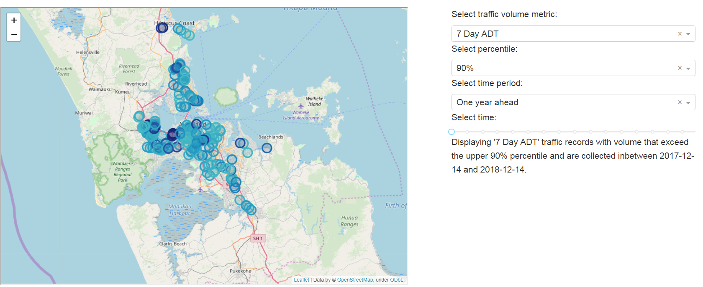
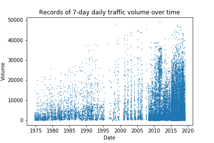
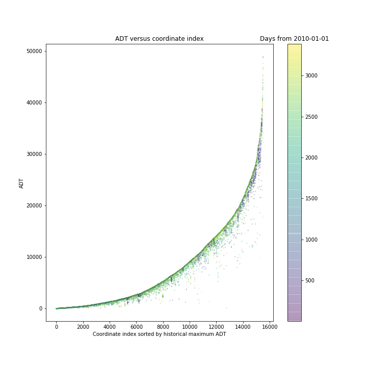
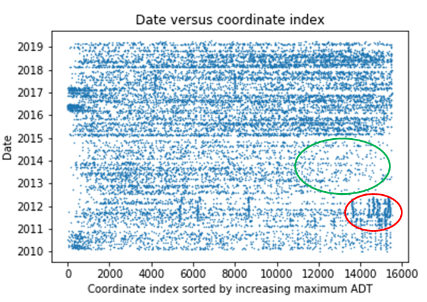
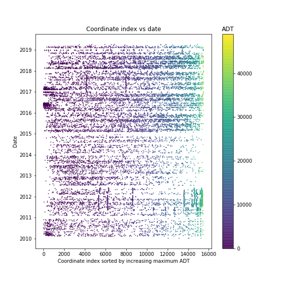
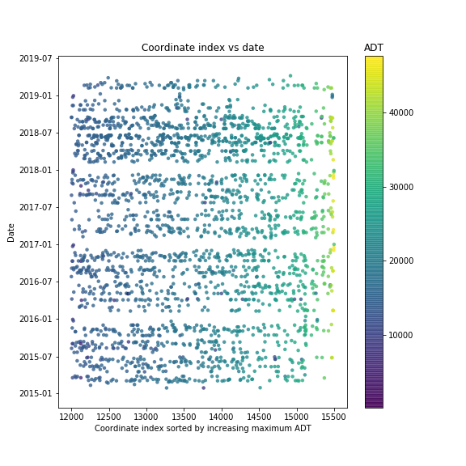
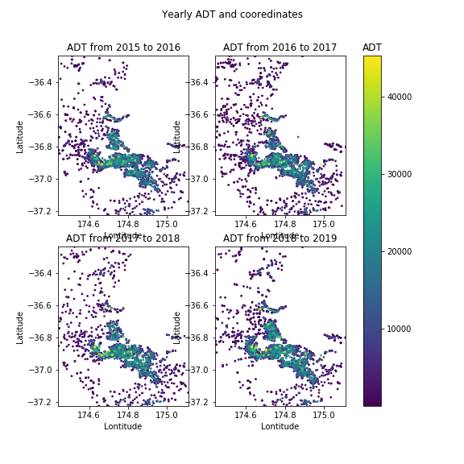
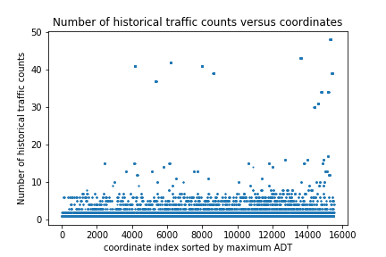
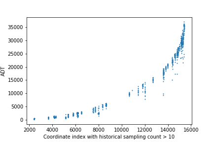
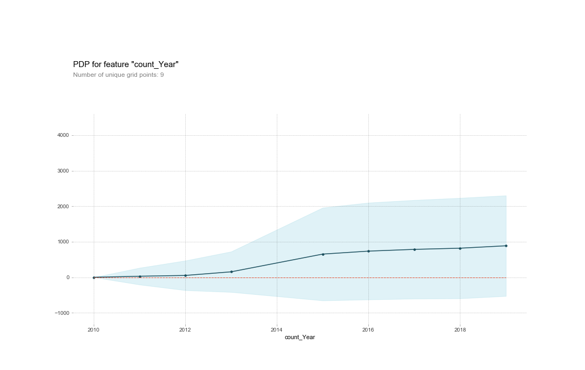

# Auckland_traffic
In this project, we analyse the change of Auckland traffic volume over time. The model developed from this work can be useful for discovering insights or identifying abnormal traffic changes.

Interactive visualization of the data is available at https://akl-traffic-vis.herokuapp.com/. 

## Abstract
In this work we conduct analysis on Auckland traffic count data to see if the data can be used to provide insights for traffic design and planning. Since the traffic count coordinates and traffic count frequencies are not consistant over time, it is hard to find two comparible samples for statistical inference. Instead, I develope a random forest model with the data and illustrate that insights can be drawn from the model using partial dependent plot. The model achieves an excellent accuracy using a shuffled testing set (97% R-squared value) but the accuracy dropped when back-testing is used (86.86% R-squared value). One reason for the discrepency could be due to infrasturcture projects taking places over Auckland. Since the (shuffled-testing) model has an excellent fit, we can use the model to identify potential abnormal traffic changes by finding large differences between the forecasted value and the actual observations. 

## Data
Data was obtained from 
https://at.govt.nz/about-us/reports-publications/traffic-counts/ on 2019/07/02. 
There were two files available. File `traffic-counts-to-march-2018-2019.csv` contains records from
2015-11-04 to 2019-04-09 and the fields are explained on the website. File 
`traffic-counts-to-march-2018-2019.csv` contains data from 1958-10-01 to 2018-11-16, however the fields
are different from the other file and were not explained. The two files were merged by a common traffic measure: `7-day average traffic count`(ADT) along with 
the coordinates and the road name. We transfer the coordinates from NZTM to latitudes and longitudes since they are easier to work with python mapping packages (e.g. folium or mapbox). Details on data cleaning and merging can be found at [1_data_cleaning.ipynb](1_data_cleaning.ipynb). 

## Exploratory analysis
In this analysis we use ADT as the representitive measure of traffic volume since ADT is one of the common fields in both files. We note that from the initial exploratory analysis of file `traffic-counts-to-march-2018-2019.csv`, we found all other traffic volume measures are highly correlated with ADT, so ADT is likely to be a good representative measure for traffic volume, at least for years 2018 and 2019.  

The merged data contains records from 1975 to 2019. By plotting the changes of ADT over time, we 
can see gradual increase in traffic volume clearly. 

In particular, we notice that the sampling density is much higher after around 2010. 
The traffic volume reached 
a peak around 2012, followed by a noticable decrease, both in the high percentile traffic volumes and in the number of traffic counts. 
The volume and the number of traffic counts then increase again and becomes more stable after 2015. 
We will focus on the records collected after 2010, since these records have similar sampling frequency and therefore are 
more comparible. The following figures presents a closer view at the data after 2010.

The following figure depicts the historical ADT and the coordinate index. The coordinate indices are sorted by 
increasing maximum ADT and the points are colored by days elapesd from 2010-01-01. 
We can see that the maximum ADT of a location is usually the most recent ADT record.

Plotting the scatter plot of date versus coordinate index shows that the sampling pattern varies 
over time. For example, we can see there is a dense sampling of the coordinates with high ADT volumes around 
2011 and 2012 (circled in red) and a sparse sampling of coordinates with high ADT from mid 2012 
to early 2015 (circled in green).

Looking at ADT with color scale shows that ADT over time for the coordinate indices appears to be stable. 

Looking at the records after 2015 and coordinate index larger than 12000 shows that there are a few 
variations of ADT over time but a systematical change in ADT is not observed.

The same conclusion is observed from the plot of ADT and coordinates. Note that there is 
a high sampling density near central Auckland.

We also found certain locations are repeatly sampled and the variations between historical samples are 
reasonably consistant.

 

## Insights from exploratory analysis
Since both traffic count coordinates and traffic count frequencies vary over time, finding two 
comparible samples from the dataset to conduct statistical testing is difficult. An alternative approach to find insights or to identify 
traffic trends from the dataset is to construct a model on top of the data and 
make inference from model outputs.

## Predictive modelling
Notebooks for model building are available at [5 Data cleaning - new data obtained 20190728.ipynb](5%20Data%20cleaning%20-%20new%20data%20obtained%2020190728.ipynb) and [6_predictive_modelling.ipynb](6_predictive_modelling.ipynb). 

We use both [traffic count data](https://data-atgis.opendata.arcgis.com/datasets/average-daily-traffic-counts) and [traffic management level](https://data-atgis.opendata.arcgis.com/datasets/traffic-management-levels) data to build the predictive model. We focus on traffic count data after 2010 since the sampling pattern obtained before 2010 is very different from those after 2010 (as observed in the exploratory analysis). We add in date parts (i.e. year, month, week of the year, time elapsed etc) to the dataset and use random forest as the predictive model motivated by the ease of model interpretability.

By fitting the model with a shuffled train-validation split, we obtain the following scores:

- training rmse: 906.39
- test rmse: 2362.21
- train R-squared: 99.55%
- test R-squared: 97.08%
- out-of-bag R-squared: 96.73

The results show an excellent model fit. The out-of-bag R-squared value is just slightly lower than the R-squared of the test set, indicates that the testing set is a good generalization of the training set. The rmse values may seem quite high at the first sight given the high R-squared values, but note that the standard deviation of ADT values is 13596 so a test rmse of 2362 is actually quite good. 

### Partial dependent plot
The model can be used to provide useful insights. One way to do so is to plot the [partial dependent plot](https://christophm.github.io/interpretable-ml-book/pdp.html). Partial dependent plot depicts the average effects of one or more features to the predicted value of interest. 

As an example, We use partial dependent plot to show how the traffic volume changes over time. 

From the plot, we can see the rate of increase in ADT is the highest during 2013 to 2015. During the same period there is also an rapid increase in the standard deviaiton (shaded area) of ADT.

### Back-testing and finding abnormal traffic changes
We apply back-testing validation to see how well the predictive model works for forecasting. Using expanding-window back-testing with data after 2017 as the test set and with time steps of 2 months leads to an averaged validation R-squared score of 86.86%. The validation score varies from 75% to 94%. One reason for the variations of the validation scores could be the change of road infrastructures. There were 3318 [infrastructure projects](https://data-atgis.opendata.arcgis.com/datasets/at-infrastructure-projects) in Auckland between 2017 and 2019. Adding data of the infrastructure projects could potentially improve the back-testing score. Unfortunately, I do not have the domain knowledge of the data and the coordinate details are not available in tabular form so the data is not used. 

Since the (shuffled-testing) model has an excellent fit, we can use the model to identify abnormal traffic changes i.e. if there is a large difference between the forcasted value and the actual observation, then there could be some kind of external factors that are changing the traffic volume. An example is illustrated in [7_Finding_abnormal_behaviours.ipynb](https://github.com/klin059/Auckland_traffic_analysis/blob/master/7_Finding_abnormal_behaviours.ipynb).

